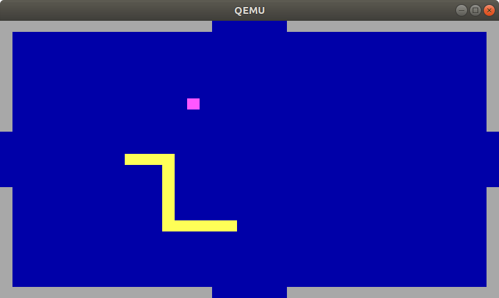
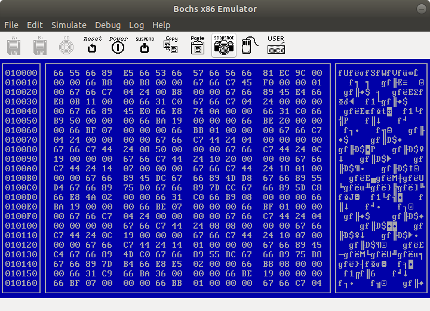

## Introduction

See the corresponding [article](ARTICLE.md)

## Prerequisites

- Clang or GCC (with support for i386 targets)
- GNU binutils
- QEMU / Bochs (for testing and debugging)
- A PC supporting USB boot in BIOS ("legacy") mode
- A spare USB disk / SD card

*Note for Mac users: clang in the latest XCode doesn't support i386, and
homebrew's binutils doesn't include GNU ld. I recommend installing MacPorts
and their i386-elf-gcc & i386-elf-binutils packages, and updating Makefile
accordingly*

## Compiling:
```
$ make
```

## Testing in emulators:
```
$ make qemu APP=snake
$ make bochs APP=hexview
```

## Installing on a USB disk / SD card:

Be careful to pick the right device, this will destroy your data!

```
$ make disk APP=hello
$ sudo dd if=build/disk.img of=/dev/<USB DISK>
```

## Screenshots




